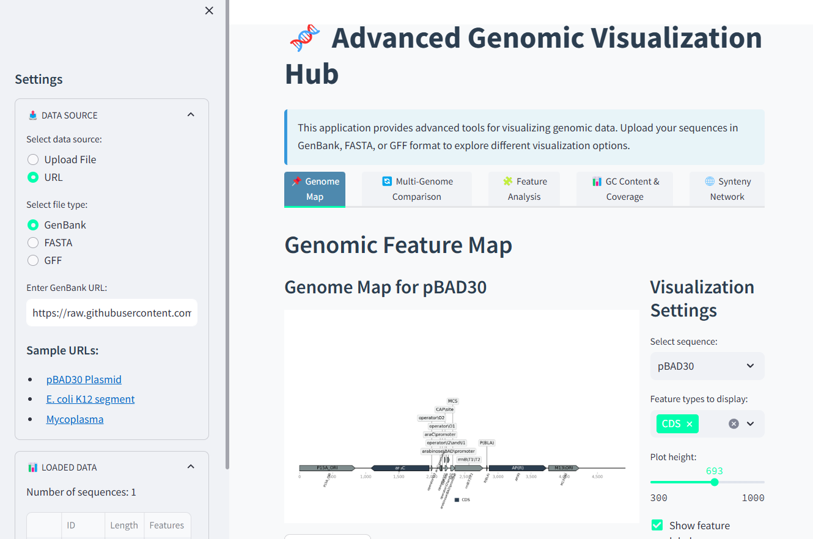
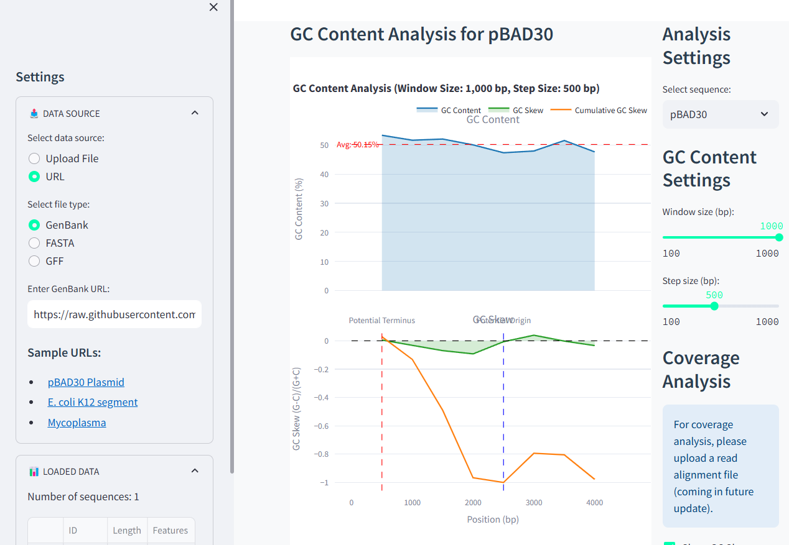

# Genomic Visualization Hub

An advanced interactive application for genomic data visualization and analysis, built with Streamlit.

## Dashboard Examples


*Main genome visualization interface with interactive features*


*Multi-genome comparison and analysis view*

## Features

- **Genome Map Visualization**: Interactive linear and circular genome maps with customizable feature highlighting
- **Multi-Genome Comparison**: Compare multiple genomes with synteny visualization
- **Feature Analysis**: Analyze distribution, length statistics, density, and strand bias of genomic features
- **GC Content & Coverage Analysis**: Visualize GC content, GC skew, and identify potential origin/terminus of replication
- **Synteny Network Analysis**: Explore genome-genome and gene-gene relationships through network visualization

## Installation

1. Clone this repository:
   ```
   git clone https://github.com/yourusername/genomic-visualization-hub.git
   cd genomic-visualization-hub
   ```

2. Create a virtual environment and activate it:
   ```
   python -m venv venv
   source venv/bin/activate  # On Windows: venv\Scripts\activate
   ```

3. Install dependencies:
   ```
   pip install -r requirements.txt
   ```

## Usage

1. Start the Streamlit app:
   ```
   streamlit run app.py
   ```

2. Open your web browser and navigate to the URL displayed in the terminal (typically http://localhost:8501)

3. Upload your genomic data (GenBank, FASTA, or GFF format) using the sidebar

4. Explore the different visualization tabs

## Supported File Formats

- **GenBank (.gb, .gbk)**: Sequence with annotations
- **FASTA (.fasta, .fa, .fna)**: DNA/protein sequences
- **GFF/GFF3 (.gff, .gff3)**: General feature format for annotations (requires accompanying FASTA file for visualizations)

## Example Usage

### Genome Map Visualization

Upload a GenBank file and navigate to the "Genome Map" tab to visualize the genomic features. You can choose between linear and circular visualizations, filter by feature types, and customize the display options.

### Multi-Genome Comparison

Upload a file with multiple sequences or multiple files to compare genomes. The visualization shows homologous regions between genomes with color-coded links based on sequence identity.

### Feature Analysis

Analyze the distribution, length statistics, density, and strand bias of genomic features. This helps identify patterns and trends in your genomic data.

### GC Content & Coverage Analysis

Visualize GC content and GC skew across the genome. For bacterial genomes, this can help identify the origin and terminus of replication.

### Synteny Network Analysis

Explore relationships between genomes or genes through network visualization. This helps identify gene families and evolutionary relationships.

## Advanced Customization

The application is built with extensibility in mind. You can customize the visualization parameters through the user interface. For more advanced customization, you can modify the source code.

## File Structure

```
genomic-visualization-hub/
├── app.py                  # Main application file
├── requirements.txt        # Python dependencies
├── README.md               # This file
└── examples/               # Example data files
    ├── example1.gb         # Example GenBank file
    └── example2.fasta      # Example FASTA file
```

## Contributing

Contributions are welcome! Please feel free to submit a Pull Request.

## License

This project is licensed under the MIT License - see the LICENSE file for details.

## Citation

If you use this tool in your research, please cite:

```
Author, A. (2025). Genomic Visualization Hub: An interactive application for genomic data visualization.
GitHub repository: https://github.com/Harrypatria/genomics_visualization_streamlit_app
```

## Acknowledgments

- Built with [Streamlit](https://streamlit.io/)
- Uses [Biopython](https://biopython.org/) for sequence parsing
- Uses [PyGenomeViz](https://github.com/moshi4/pygenomeviz) for genome comparison visualization
- Uses [DNA Features Viewer](https://github.com/Edinburgh-Genome-Foundry/DnaFeaturesViewer) for linear genome visualization
- Uses [Plotly](https://plotly.com/) for interactive visualizations
- Uses [NetworkX](https://networkx.org/) for network analysis
